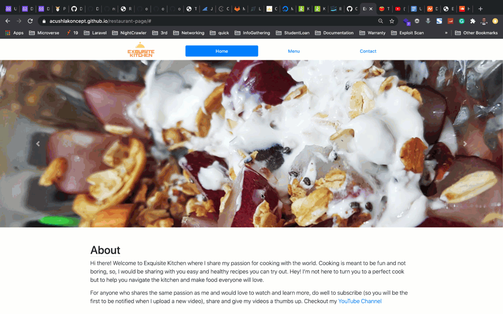

# Restaurant Page

In this project, I built a Simple Restuarant Page App using webpack to practice DOM manipulation by dynamically rendering its various pages: Home, Menu, and Contact.




## Live Demo
[Live view](https://acushlakoncept.github.io/restaurant-page/)

## Built With

- HTML
- JavaScript
- BootStrap

## Getting Started

To get a local copy of the repository please run the following commands on your terminal:

```bash
$ cd <folder>
$ git clone https://github.com/acushlakoncept/restaurant-page.git
$ cd restaurant-page
```

## Author

**Uduak Essien**

- Github: [@acushlakoncept](https://github.com/acushlakoncept/)
- Twitter: [@acushlakoncept](https://twitter.com/acushlakoncept)
- Linkedin: [acushlakoncept](https://www.linkedin.com/in/acushlakoncept/)

## 🤝 Contributing

Contributions, issues and feature requests are welcome!

Feel free to check the [issues page](https://github.com/acushlakoncept/restaurant-page/issues).

## Show your support

Give a ⭐️ if you like this project!
